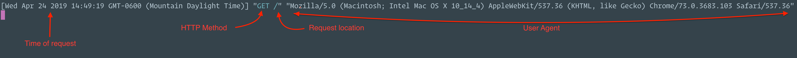
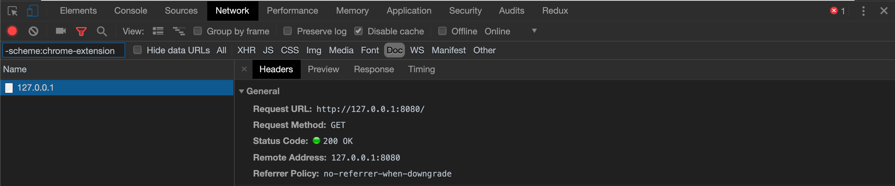
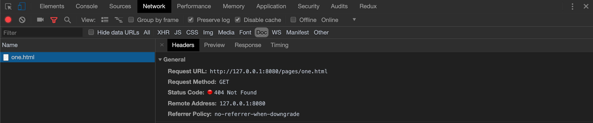

# Project Summary
---
Learn how a client and server interact using HTTP over the internet or other network.

Our goal in this project is to solidify our understanding of what a client and server are in relation
to the internet, and also understand how clients and servers interact over the internet.

In the case of this project the **client** or **user-agent**, as it is sometimes referred to in the web
development world, is going to be our web-browser. This is typically what we mean when we refer to the client in
a web development context.

We all probably have a web-browser installed on our computers, so we don't need to worry about that
at the moment. But we need to install something that can be considered a server.

A server in the context of web development is basically any program that can respond to client requests
while adhering to the HTTP network protocol. So we need to install a program that can do that, many people
would refer to that program as an http server (a server that accepts and responds to http requests).

### Exercise 1: Install an http server and serve a webpage
---
#### Step 1:
**Summary** - Install the http server.

**Pre-Requisites**:
  - `npm` must be installed on your computer (you can check by running `npm -v` in your terminal)
    it should output the version of `npm` you have installed.

**Instructions**:
  - Open a terminal
  - Install the `http-server` package using `npm`
    - **command**: `npm install --global http-server`
    - **explanation**: The command above instructs `npm` to install a package globally, the idea being that
      we want to be able to use that package from anywhere on our computer.
  - Check your installation
    - **command**: `http-server`
    - **explanation**: This will run the http server you should see output like below

          Starting up http-server, serving ./
          Available on:
            http://127.0.0.1:8080
            http://10.1.20.69:8080
            http://10.1.20.104:8080
          Hit CTRL-C to stop the server

#### Step 2:
**Summary** - Create content for server to serve.

**Instructions**:
  - Create an `index.html` file at the root of this repository.
  - Edit the `index.html` file to contain a valid HTML webpage.
  - Add an `h1` tag with the contents of `Hello World`.
  - Add three links below the `h1` tag in the `index.html` file.
    - first link to `pages/one.html`
    - second link to `pages/two.html`
    - third link to `pages/three.html`

#### Step 3:
**Summary** - Serve index.html with web server

**Instructions**:

  - From the root of this repository run...
    - **command**: `http-server`
    - **explanation**: This will start the http server serving content from the root of this directory
      you should see the following output

          Starting up http-server, serving ./ # notice here it is serving this directory i.e. ./
          Available on:
            http://127.0.0.1:8080 # by default the webserver is serving on address 127.0.0.1 and port 8080
            http://10.1.20.69:8080
            http://10.1.20.104:8080
          Hit CTRL-C to stop the server

         **Note**:
         > **Address**: `127.0.0.1` is a special address, it's the address of our local machine it is often also
         > referred to as `localhost`. You could also visit the address `localhost:8080` and it would be the
         > same location.
         >
         > **Port**: the `8080` part of the address is called a port number. You can think of port numbers
         > much like a telephone number extension. We can have one address `127.0.0.1` but many different
         > processes listening to specific ports. In this case our http-server is listening on port `8080`

  - Now open your web-browser and navigate to address `127.0.0.1:8080`.
    - You should see your Hello World webpage with its three links displayed in you browser
    - **explanation**: You just told your web-browser (client) to make a `GET` request to `127.0.0.1:8080`.
      the http server we started, that is listening on `127.0.0.1:8080`, sent a response back and that
      response was the `index.html` document. Now if you're observant you'll notice that we did not specify
      that we wanted the `index.html` document i.e. `127.0.0.1:8080/index.html`, but the http server gave
      us that document by default. This is the typical behavior most http servers adhere to, by default
      they will serve the `index.html` file it resides at the root of the of location being served.
  - Now go back to your terminal where the http servier is running. There you should see the logs of the request
    that the server has handled.

    > #### Server Log 1
    > 

  - Open the browser development tools and reload the page. You can also see the request log from the
    client side.

    > #### Client Log 1
    > 

  - Go back to the web-browser and click on link one. You'll notice that the request fails and
    the page can't be found. This is because the http server doesn't have a `pages/one.html` document
    to serve. Go look at the http server log again.

    > #### Log 2
    > 
    > You'll notice the first log line is the `GET` request for location `/pages/one.html`.
    > That file does not exist so the http server sends a response back to the client with a
    > `404` error message which indicates the requested resource could not be found.

  - Look at the browser development tools again. You can see the failed request for the `pages/one.html`.

    > #### Client Log 2
    > 

  - Now go back and add a `pages` directory and add `HTML` documents for `pages/one.html` `pages/two.html` `pages/three.html`
  - Now try navigating to one of those pages again, and you should see your web-browser successfully navigate to those pages.
  - You should now have a basic understanding of how clients and servers request and serve html documents using HTTP.
